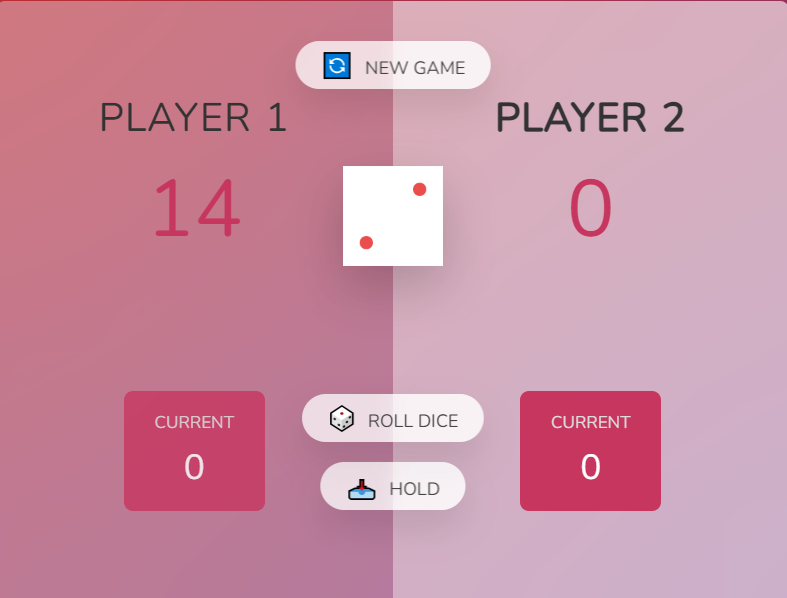

This Repo demonstrate the basic operation of JavaScipt like how to access the different html tags, manipulating the css and how to use the eventhandlers.

# Guess My Number:

It is a Simple guessing game, You have to guess a number between 1 and 20. If you guess the number correctly, the background color will change to green, and the high score will be updated. If your guess is incorrect, you will receive hints indicating whether your guess is too high or too low. You have a total of 20 chances to guess the number correctly. Continue guessing until you find the correct number.

# Modal Window:

This project implements a modal window functionality using JavaScript. The modal can be opened and closed using various triggers, and it includes accessibility features for closing the modal with the keyboard.

## Features:

- **Open Modal**: Click any of the buttons with the class `.show-modal` to open the modal window.
- **Close Modal**:
  - Click the close button inside the modal (with the class `.close-modal`).
  - Click on the overlay background.
  - Press the `Escape` key on the keyboard when the modal is open.
- **Accessibility**: The modal closes when the `Escape` key is pressed, enhancing accessibility.

# Dice Game 🎲

This is a simple two-player dice game where the first player to reach a score of 50 wins. The game is built using HTML, CSS, and JavaScript.

## How to Play

1. **Rolling the Dice**: Players take turns rolling a dice by clicking the "Roll Dice" button. The rolled number is added to their current score.
2. **Holding the Score**: Players can choose to "Hold" their score, which will add their current score to their total score. This ends their turn and switches to the other player.
3. **Rolling a 1**: If a player rolls a 1, their current score is reset to 0, and their turn ends immediately.
4. **Winning the Game**: The first player to reach a total score of 50 wins the game.
5. **Starting a New Game**: Click the "New Game" button to reset the game at any time.

## Features

- **Player Switching**: The game automatically switches between Player 1 and Player 2.
- **Winner Highlight**: The winner is highlighted with a special class.
- **Responsive Design**: The game layout adjusts for different screen sizes.
